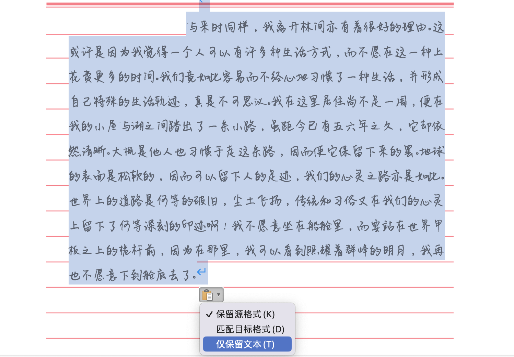
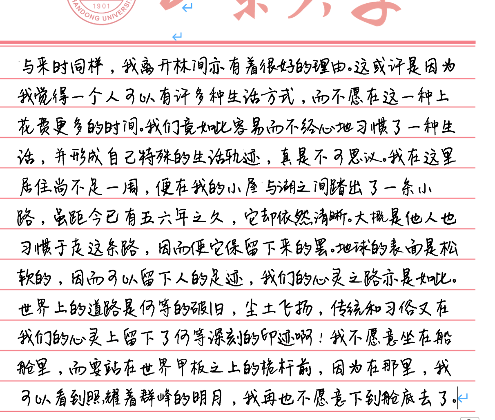
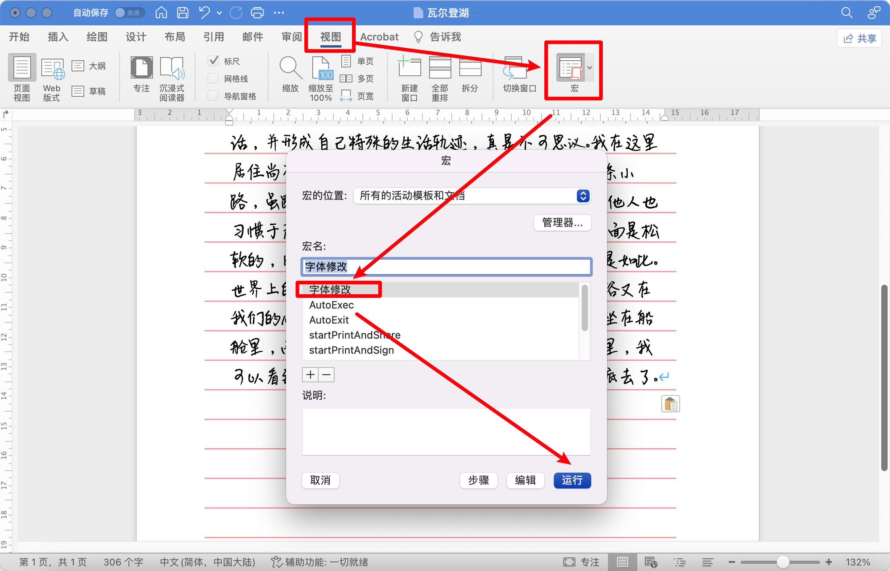
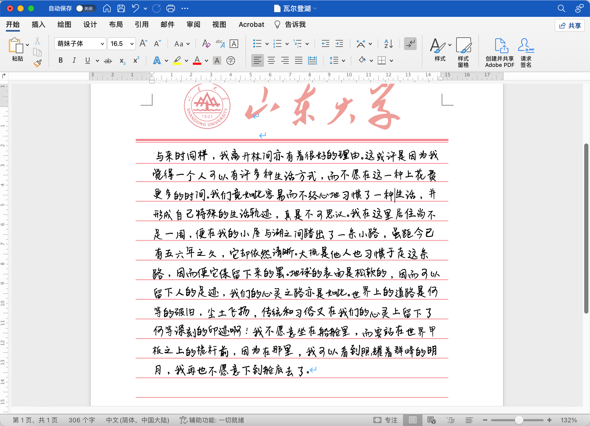
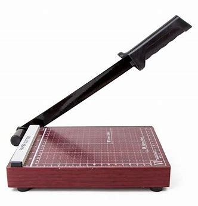
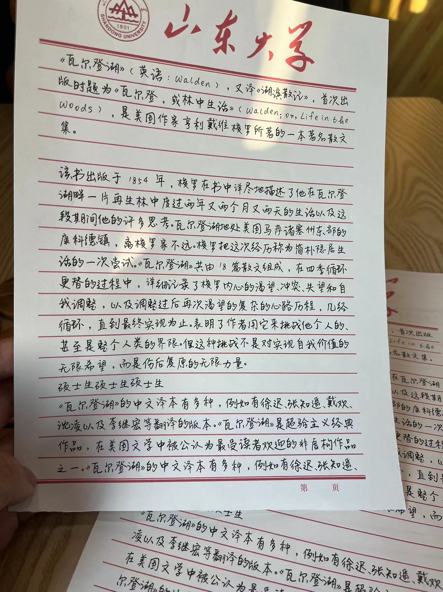

# 山大信纸手写模拟

## Intro

这是一个仓库, 有xyy绘制的山大信纸`山大信纸.ai`, 还包含了以下教程, 可以让有需要模拟书写的同学快速优雅地在山大信纸上生成模拟手写体. 
有同学不会用Github, 这里给出该仓库文件的另一个下载地址, 需要代理: https://drive.google.com/file/d/1bL9icDrDcJI5qrJGn4nZDiZCEoMILA2o/view?usp=sharing 

## Requirements

靠谱的打印店, 电脑, Word(WPS无法保证能否使用)

## 基本使用

1. 准备好文本

   > …
   >
   > 与来时同样，我离开林间亦有着很好的理由。这或许是因为我觉得一个人可以有许多种生活方式，而不愿在这一种上花费更多的时间。我们竟如此容易而不经心地习惯了一种生活，并形成自己特殊的生活轨迹，真是不可思议。我在这里居住尚不足一周，便在我的小屋与湖之间踏出了一条小路，虽距今已有五六年之久，它却依然清晰。大概是他人也习惯于走这条路，因而使它保留下来的罢。地球的表面是松软的，因而可以留下人的足迹，我们的心灵之路亦是如此。世界上的道路是何等的破旧，尘土飞扬，传统和习俗又在我们的心灵上留下了何等深刻的印迹啊！我不愿意坐在船舱里，而要站在世界甲板之上的桅杆前，因为在那里，我可以看到照耀着群峰的明月，我再也不愿意下到舱底去了。

2. 安装好字体`萌妹子字体(6000字).ttf`

3. 打开docx文件, 把文本不带格式地放进去

   

4. 选择已经安装的`萌妹子字体`

   

5. 选择文本, 使用宏`字体修改`, 目的是为了增加扰动, 尽可能模拟真实人类不定的书写风格.

   该宏的代码(参考自知乎回答)如下, 如果没有可以自己添加上, 具体过程请用搜索引擎查询:

   ```
   Sub 字体修改()
   '
   ' 字体修改 宏
   '
       Dim R_Character As Range
   
   
       Dim FontSize(5)
       ' 字体大小在5个值之间进行波动，可以改写
       FontSize(1) = "15.5"
       FontSize(2) = "17"
       FontSize(3) = "16.8"
       FontSize(4) = "16.2"
       FontSize(5) = "15.7"
   
   
   
       Dim FontName(1)
       '字体名称在三种字体之间进行波动，可改写，但需要保证系统拥有下列字体
       FontName(1) = "萌妹子体"
   
   
       Dim ParagraphSpace(5)
       '行间距 在一定以下值中均等分布，可改写
       ParagraphSpace(1) = "28.1"
       ParagraphSpace(2) = "28.3"
       ParagraphSpace(3) = "27.5"
       ParagraphSpace(4) = "28"
       ParagraphSpace(5) = "28.9"
   
       '不懂原理的话，不建议修改下列代码
   
       For Each R_Character In ActiveDocument.Characters
   
           VBA.Randomize
   
           R_Character.Font.Name = FontName(1)
   
           R_Character.Font.Size = FontSize(Int(VBA.Rnd * 5) + 1)
   
           R_Character.Font.Position = Int(VBA.Rnd * 3) + 1
   
           R_Character.Font.Spacing = 0
   
   
       Next
   
       Application.ScreenUpdating = True
   
   
   
       For Each Cur_Paragraph In ActiveDocument.Paragraphs
   
           Cur_Paragraph.LineSpacing = ParagraphSpace(Int(VBA.Rnd * 5) + 1)
   
   
       Next
           Application.ScreenUpdating = True
   
   
   End Sub
   
   ```

   

6. 宏运行后字体可能发生改变, 改回已经安装的`萌妹子字体`即可
   

7. 在打印前注意是否每一行的位置都在线上, 可以单独对某几行的行间距进行微调. 建议让店家使用**道林纸**进行打印, 会更像是印刷厂出来的特殊纸张, 而不是普通A4打印纸.

8. 选择打印, 注意使用`实际大小`选项, 或者是不要缩放. 这是要求严格按我绘制的山大信纸大小进行打印, 而不要进行自动放缩.

9. 再打印一张`山大信纸_带范围.pdf`, 这个是作为范围界定使用. 因为我们是用A4纸进行打印, 但是真实的山大信纸是接近B5大小的, (大部分山大信纸, 不同校区超市的信纸大小格式其实都不统一, 可能是由多个厂家随意设计印出来贩卖的.)

10. 打印出来后, 把`山大信纸_带范围.pdf`放在第一张, 然后去打印店借那种裁纸刀(一般正经打印店都有, 青岛校区图书馆一楼也有), 如下图所示, 按照定界框裁切一下, 可以微调.

    

11. 效果:

    
